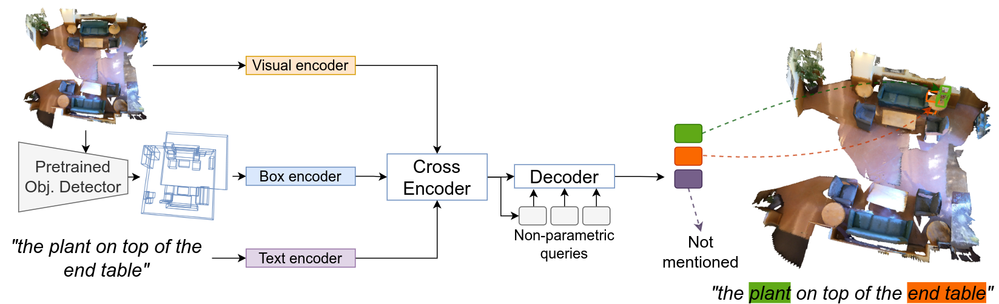

# Bottom Up and Top Down Detection Transformers for Language Grounding in Images and Point Clouds


By [Ayush Jain](https://github.com/ayushjain1144), [Nikolaos Gkanatsios](https://github.com/nickgkan), [Ishita Mediratta](https://github.com/ishitamed19), [Katerina Fragkiadaki](https://www.cs.cmu.edu/~katef/).

Official implementation of ["Bottom Up and Top Down Detection Transformers for Language Grounding in Images and Point Clouds"](https://arxiv.org/abs/2112.08879), accepted by ECCV 2022.




**Note:**

This is the code for the 2D BUTD-DETR. For the 3D version check the `main` branch.


## Installation

### Requirements

* Linux, GCC>=5.5 <=10.0
  
* Python>=3.8

    We recommend you to use Anaconda to create a conda environment:
    ```bash
    conda create -n bdetr2d python=3.8
    ```
    Then, activate the environment:
    ```bash
    conda activate bdetr2d
    ```
  
* PyTorch>=1.5.1, torchvision>=0.6.1 (following instructions [here](https://pytorch.org/))

    For example, if your CUDA version is 10.2, you could install pytorch and torchvision as following:
    ```bash
    conda install pytorch=1.5.1 torchvision=0.6.1 cudatoolkit=10.2 -c pytorch
    ```
  
* Other requirements
    ```bash
    pip install -r requirements.txt
    ```

* Compiling CUDA operators
  ```bash
  sh init.sh
  ```


## Data Preparation

* Download the original Flickr30k image dataset from : [Flickr30K webpage](http://shannon.cs.illinois.edu/DenotationGraph/) and update the `flickr_img_path` to the folder containing the images.
* Download the original Flickr30k entities annotations from: [Flickr30k annotations](https://github.com/BryanPlummer/flickr30k_entities) by cloning it and update the `flickr_dataset_path` to the folder with annotations.
* Download the gqa images at [GQA images](https://nlp.stanford.edu/data/gqa/images.zip) and update `vg_img_path` to point to the folder containing the images.
* Download COCO images [Coco train2014](http://images.cocodataset.org/zips/train2014.zip). Update the `coco_path` to the folder containing the downloaded images.
* Download MDETR's pre-processed annotations that are converted to coco format (all datasets present in the same zip folder for MDETR annotations): [Pre-processed annotations](https://zenodo.org/record/4729015/files/mdetr_annotations.tar.gz?download=1)
* Download additional files which include the bottom-up detected boxes from Faster-RCNN (trained on VG): [extra_data](https://drive.google.com/file/d/1tIL7VBXHfG71ccIXwPSauP_7WyHAL0rg/view?usp=sharing). 
If you want to download it using terminal, you can install [gdown](https://pypi.org/project/gdown/) and run `gdown 1tIL7VBXHfG71ccIXwPSauP_7WyHAL0rg` (gdown is not always reliable though)
* Unzip `extra_data.zip` and move `instances_train2014.json` from the unzipped folder to the parent folder of `train2014` folder (In other words `train2014` and `instances_train2014.json` should be inside same parent folder)


## Pre-trained checkpoints
Download our checkpoints for [pretraining](https://zenodo.org/record/6430189/files/pretrain_2d.pth?download=1), [RefCOCO](https://zenodo.org/record/6430189/files/refcoco_85.9.pth?download=1), [RefCOCO+](https://zenodo.org/record/6430189/files/refcoco_plus_78.2.pth?download=1). Add `--resume CKPT_NAME` to the above scripts in order to utilize the stored checkpoints. Since we don't do additional fine-tuning on Flickr, you can use `pretraining` checkpoint to evaluate on Flickr. You can also use `pretraining` checkpoint to finetune on your own datasets. 

Note that these checkpoints were stored while using `DistributedDataParallel`. To use them outside these checkpoints without `DistributedDataParallel`, take a look [here](https://discuss.pytorch.org/t/solved-keyerror-unexpected-key-module-encoder-embedding-weight-in-state-dict/1686).


## Usage

### Training

Scripts for running training/evaluation are as follows:

```bash
sh scripts/run_train_pretrain.sh          # for pretraining
sh scripts/run_train_flickr.sh            # for flickr
sh scripts/run_train_refcoco.sh           # for refcoco
sh scripts/run_train_refcoco_plus.sh      # for refcoco+
```

For running on multiple GPUs, you can change `run_train` files. For example, to run pre-training on 8 GPUs, you can change `run_train_pretrain.sh` to:

```bash
GPUS_PER_NODE=8 ./tools/run_dist_launch.sh 8  ./configs/pretrain.sh 
```

Some other useful flags are:

- ```--eval```: Add it to skip training and just evaluate. You can remove it to train the model. 
- ```--resume```: Add this flag and the path to the checkpoint you want to evaluate.


### General Recommendations

- We have found the default learning  rates in main.py to work well if your effective batch size is low (like <10). If you are running on larger number of GPUs, you might want to enable ``--large_scale`` flag and increase the learning rates (refer to `configs/pretrain.sh` whose hyperparameters are set to work with 64 GPUs). Due to computational limitations, we couldn't tune these hyperparameters and hence you might get better results by hyperparameter tuning
- You might see slightly worse results when evaluating with batch size > 1. This is because we used batch size 1 during training, and hence the model never saw padded images. For more details, please refer this [issue](https://github.com/facebookresearch/detr/issues/217#issuecomment-684087741)


## Acknowledgements

Parts of this code were based on the codebase of [MDETR](https://github.com/ashkamath/mdetr) and [Deformable-DETR](https://github.com/fundamentalvision/Deformable-DETR)


## Citing BUTD-DETR
If you find BUTD-DETR useful in your research, please consider citing:
```bibtex
@misc{https://doi.org/10.48550/arxiv.2112.08879,
        doi = {10.48550/ARXIV.2112.08879},
        url = {https://arxiv.org/abs/2112.08879},
        author = {Jain, Ayush and Gkanatsios, Nikolaos and Mediratta, Ishita and Fragkiadaki, Katerina},
        keywords = {Computer Vision and Pattern Recognition (cs.CV), Computation and Language (cs.CL), FOS: Computer and information sciences, FOS: Computer and information sciences},
        title = {Bottom Up Top Down Detection Transformers for Language Grounding in Images and Point Clouds},
        publisher = {arXiv},
        year = {2021},
        copyright = {Creative Commons Attribution 4.0 International}
      }
    
```


## License

The majority of BUTD-DETR code is licensed under CC-BY-NC, however portions of the project are available under separate license terms: [MDETR](https://github.com/ashkamath/mdetr) and [Deformable-DETR](https://github.com/fundamentalvision/Deformable-DETR) are licensed under the Apache 2.0 license.
